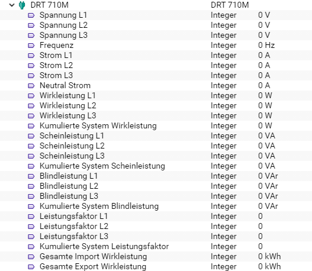

[](https://www.symcon.de/service/dokumentation/entwicklerbereich/sdk-tools/sdk-php/)
[](https://community.symcon.de/t/modul-alle-modbus-zaehler-von-b-g-e-tech/45290)
[](https://creativecommons.org/licenses/by-nc-sa/4.0/)  
[](https://www.symcon.de/service/dokumentation/installation/migrationen/v50-v51-q2-2019/)
[](https://github.com/Nall-chan/BGETech/actions) 
[](https://github.com/Nall-chan/BGETech/actions)  
[](#2-spenden)    


# DRT 710M <!-- omit in toc -->  

## Inhaltsverzeichnis <!-- omit in toc -->

- [1. Funktionsumfang](#1-funktionsumfang)
- [2. Voraussetzungen](#2-voraussetzungen)
- [3. Software-Installation](#3-software-installation)
- [4. Einrichten der Instanzen in IP-Symcon](#4-einrichten-der-instanzen-in-ip-symcon)
- [5. Statusvariablen und Profile](#5-statusvariablen-und-profile)
- [6. PHP-Befehlsreferenz](#6-php-befehlsreferenz)
- [7. Anhang](#7-anhang)
  - [1. Changelog](#1-changelog)
  - [2. Spenden](#2-spenden)
- [8. Lizenz](#8-lizenz)

## 1. Funktionsumfang

Ermöglicht die einfache Einbindung von Energie-Zählern des Typs DRT 710M der Firma B+G E-Tech.  
Zusätzlich können mehrere Zähler auf einem physikalischen RS485-Bus betrieben werden.  

## 2. Voraussetzungen

 - IPS 5.1 oder höher  
 - DRT 710M Zähler mit **ModBus-Interface**  
 - physikalisches RS485 Interface für die Zähler  

## 3. Software-Installation

 Dieses Modul ist Bestandteil der [B+G E-Tech Library](../README.md#3-software-installation). 

## 4. Einrichten der Instanzen in IP-Symcon

Das Modul ist im Dialog 'Instanz hinzufügen' unter dem Hersteller 'B+G E-Tech' zu finden.  
  

Es wird automatisch ein 'ModBus Gateway' als Splitter-Instanz, sowie ein 'Client Socket' als dessen I/O-Instanz erzeugt.  
In dem sich öffnenden Konfigurationsformular muss der Abfrage-Zyklus eingestellt werden.  
 Über den Button 'Gateway konfigurieren' wird das Konfigurationsformular des 'ModBus Gateway' geöffnet.  
    
Hier muss jetzt der Modus passend zur Hardwareanbindung (TCP /RTU) sowie die Geräte-ID des Zählers eingestellt und übernommen werden.  
Anschließend über den Button 'Schnittstelle konfigurieren' das Konfigurationsformular der I/O-Instanz öffnen.  
Je nach Hardwareanbindung müssen hier die RS485 Parameter oder die IP-Adresse des ModBus-Umsetzers eingetragen werden.  
Details hierzu sind dem Handbuch des Zählers (RS485) und dem eventuell verwendeten Umsetzer zu entnehmen.  

## 5. Statusvariablen und Profile

Folgende Statusvariablen werden automatisch angelegt.  

|               Name                |   Typ   |          Ident           |   Profil    |
| :-------------------------------: | :-----: | :----------------------: | :---------: |
|            Spannung L1            | integer |        VoltageL1         |  Volt.230   |
|            Spannung L2            | integer |        VoltageL2         |  Volt.230   |
|            Spannung L3            | integer |        VoltageL3         |  Volt.230   |
|             Strom L1              | integer |        CurrentL1         |   Ampere    |
|             Strom L2              | integer |        CurrentL2         |   Ampere    |
|             Strom L3              | integer |        CurrentL3         |   Ampere    |
|          Wirkleistung L1          | integer |      ActivepowerL1       | Watt.14490  |
|          Wirkleistung L2          | integer |      ActivepowerL2       | Watt.14490  |
|          Wirkleistung L3          | integer |      ActivepowerL3       | Watt.14490  |
|         Scheinleistung L1         | integer |     ApparentpowerL1      |     VA      |
|         Scheinleistung L2         | integer |     ApparentpowerL2      |     VA      |
|         Scheinleistung L3         | integer |     ApparentpowerL3      |     VA      |
|         Blindleistung L1          | integer |     ReactivepowerL1      |     VaR     |
|         Blindleistung L2          | integer |     ReactivepowerL2      |     VaR     |
|         Blindleistung L3          | integer |     ReactivepowerL3      |     VaR     |
|        Leistungsfaktor L1         | integer |      PowerfactorL1       |             |
|        Leistungsfaktor L2         | integer |      PowerfactorL2       |             |
|        Leistungsfaktor L3         | integer |      PowerfactorL3       |             |
|  Kumulierte System Wirkleistung   | integer |     Totalsystempower     | Watt.14490  |
| Kumulierte System Scheinleistung  | integer | Totalsystemapparentpower |     VA      |
|  Kumulierte System Blindleistung  | integer | Totalsystemreactivepower |     VaR     |
| Kumulierte System Leistungsfaktor | integer |  Totalsystempowerfactor  |             |
|             Frequenz              | integer |        Frequency         |  Hertz.50   |
|           Neutral Strom           | integer |      Neutralcurrent      |   Ampere    |
|    Gesamte Import Wirkleistung    | integer |    Totalimportenergy     | Electricity |
|    Gesamte Export Wirkleistung    | integer |    Totalexportenergy     | Electricity |

Folgende Profile werden automatisch angelegt.  

|     Name      |   Typ   |
| :-----------: | :-----: |
|   Ampere.I    | integer |
| Electricity.I | integer |
|    Hertz.I    | integer |
|     VA.I      | integer |
|     VaR.I     | integer |
|    Volt.I     | integer |
|    Watt.I     | integer |


Darstellung in der Console.  
 

## 6. PHP-Befehlsreferenz

```php
bool DRT710M_RequestRead(int $InstanzID);
```
Ließt alle Werte vom Zähler.  
Bei Erfolg wird `true` und im Fehlerfall wird `false` zurückgegeben und eine Warnung erzeugt.  


## 7. Anhang

### 1. Changelog

[Changelog der Library](../README.md#2-changelog)

### 2. Spenden

Die Library ist für die nicht kommerzielle Nutzung kostenlos, Schenkungen als Unterstützung für den Autor werden hier akzeptiert:  

  PayPal:  
<a href="https://www.paypal.com/donate?hosted_button_id=G2SLW2MEMQZH2" target="_blank"></a>  

  Wunschliste:  
<a href="https://www.amazon.de/hz/wishlist/ls/YU4AI9AQT9F?ref_=wl_share" target="_blank"></a>  

## 8. Lizenz

  IPS-Modul:  
  [CC BY-NC-SA 4.0](https://creativecommons.org/licenses/by-nc-sa/4.0/)  
 
 
