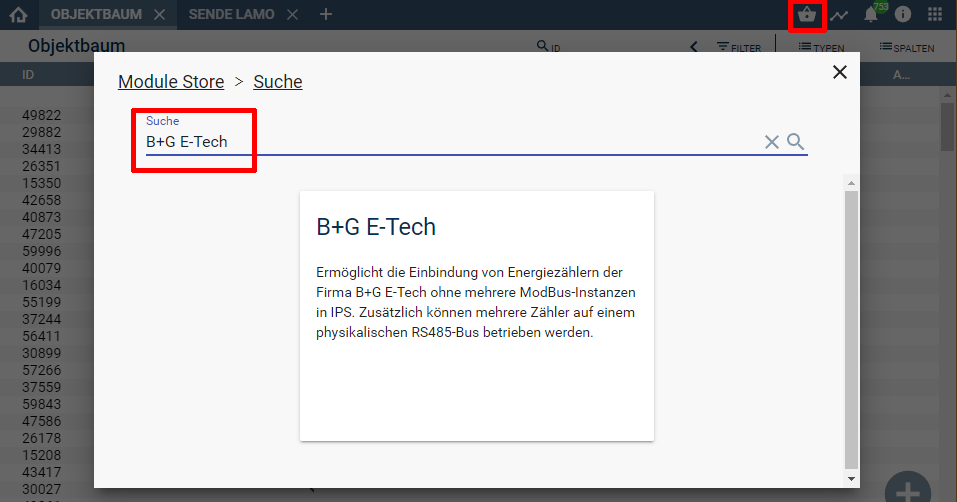

  

 
  

  

# Symcon-Modul: B+G E-Tech <!-- omit in toc -->  

## Inhaltsverzeichnis <!-- omit in toc -->

- [1. Funktionsumfang](#1-funktionsumfang)
- [2. Voraussetzungen](#2-voraussetzungen)
- [3. Software-Installation](#3-software-installation)
- [4. Einrichten der Instanzen in IP-Symcon](#4-einrichten-der-instanzen-in-ip-symcon)
- [5. Anhang](#5-anhang)
  - [1. GUID der Module](#1-guid-der-module)
  - [2. Changelog](#2-changelog)
  - [3. Spenden](#3-spenden)
- [6. Lizenz](#6-lizenz)

## 1. Funktionsumfang

Ermöglicht die Einbindung von Energie-Zählern der Firma B+G E-Tech
ohne mehrere ModBus-Instanzen in IPS.  
Zusätzlich können mehrere Zähler auf einem physikalischen RS485-Bus
betrieben werden.  

Folgende Module beinhaltet die B+G E-Tech Library:

- __DRS210C__  
	Zähler vom Typ DRS 210-C  

- __SDM120MODBUS__  
	Zähler vom Typ SDM 120-ModBus  

- __DRS458__  
	Zähler vom Typ DRS 458  

- __DRT428M__  
  Zähler vom Typ DRT 428M  

- __DRT710M__  
	Zähler vom Typ DRT 710M  

- __SDM72D__   
	Zähler vom Typ SDM 72D

- __SDM72DMV2__  
  Zähler vom Typ SDM 72DM-V2  
  
- __SDM120C__   
	Zähler vom Typ SDM 120C

- __SDM220__   
	Zähler vom Typ SDM 220  

- __SDM230__   
	Zähler vom Typ SDM 230  

- __SDM530__   
	Zähler vom Typ SDM 530 

- __SDM630__   
	Zähler vom Typ SDM 630

- __SmartX965C__  
  Zähler vom Typ Smart X96-5C/I/J  

## 2. Voraussetzungen

 - IPS 5.1 oder höher  
 - Unterstützte Zähler  
 - physikalisches RS485 Interface für die Zähler  

## 3. Software-Installation

  Über den 'Module-Store' in IPS das Modul 'B+G E-Tech' hinzufügen.  
   **Bei kommerzieller Nutzung (z.B. als Errichter oder Integrator) wenden Sie sich bitte an den Autor.**  
  

## 4. Einrichten der Instanzen in IP-Symcon

Ist direkt in der Dokumentation der jeweiligen Module beschrieben:  

- __[DRS 210-C](DRS210C/README.md#4-einrichten-der-instanzen-in-ip-symcon)__
- __[SDM 120-ModBus](SDM120MODBUS/README.md#4-einrichten-der-instanzen-in-ip-symcon)__
- __[DRS 458](DRS458/README.md#4-einrichten-der-instanzen-in-ip-symcon)__
- __[DRT 428M](DRT428M/README.md#4-einrichten-der-instanzen-in-ip-symcon)__
- __[DRT 710M](DRT710M/README.md#4-einrichten-der-instanzen-in-ip-symcon)__
- __[SDM 72D](SDM72D/README.md#4-einrichten-der-instanzen-in-ip-symcon)__
- __[SDM 72DM-V2](SDM72DMV2/README.md#4-einrichten-der-instanzen-in-ip-symcon)__
- __[SDM 120C](SDM120C/README.md#4-einrichten-der-instanzen-in-ip-symcon)__
- __[SDM 220](SDM220/README.md#4-einrichten-der-instanzen-in-ip-symcon)__
- __[SDM 230](SDM230/README.md#4-einrichten-der-instanzen-in-ip-symcon)__
- __[SDM 530](SDM530/README.md#4-einrichten-der-instanzen-in-ip-symcon)__
- __[SDM 630](SDM630/README.md#4-einrichten-der-instanzen-in-ip-symcon)__
- __[Smart X96-5C/I/J](SmartX965C/README.md#4-einrichten-der-instanzen-in-ip-symcon)__

## 5. Anhang

###  1. GUID der Module

 
|      Modul       |  Typ   |    Prefix    |                  GUID                  |
| :--------------: | :----: | :----------: | :------------------------------------: |
|    DRS 210-C     | Device |   DRS210C    | {2CA41C9F-355C-4231-90A5-6D83A90B65BD} |
|  SDM 120-ModBus  | Device | SDM120MODBUS | {007A55EC-C9C4-4241-8F39-2F0CA809F54D} |
|     DRS 458      | Device |    DRS458    | {8CA96C98-3014-44E4-8D15-4EC6B524F1F4} |
|     DRT 428M     | Device |   DRT428M    | {7EE791EF-574D-4B52-84D7-331CFDF0C512} |
|     DRT 710M     | Device |   DRT710M    | {187BB86B-A52F-4ADD-A233-92108BD71767} |
|     SDM 72D      | Device |    SDM72D    | {08371372-5993-4BAF-A6EC-D70759709CD9} |
|   SDM 72DM-V2    | Device |  SDM72DMV2   | {A4320883-E4EE-4F01-B0CC-B1DDF3E73ACA} |
|     SDM 120C     | Device |   SDM120C    | {32DCCC5C-78D3-475E-885A-652F56DB4D18} |
|     SDM 220      | Device |    SDM220    | {93668601-F92A-46FC-AE5B-E44451F022EE} |
|     SDM 230      | Device |    SDM230    | {10D08FCD-D1AC-4CF3-8B19-54B92209DA07} |
|     SDM 530      | Device |    SDM530    | {9A65E88A-21DC-439F-8602-CA14EE9FDF27} |
|     SDM 630      | Device |    SDM630    | {BBCA5E14-505E-4394-B653-8CD33AD52037} |
| Smart X96-5C/I/J | Device |    X965C     | {E151A4EC-51E8-4066-9FC3-D724E846D3B2} |

### 2. Changelog

__Version 3.51:__  
 -  DRT 428M Powerfaktor L3 war defekt  
 -  DRT 428M Profile für Wirkleistung korrigiert  

__Version 3.50:__  
 - Smart X96-5C/I/J ergänzt  
 - Fehlende Übersetzungen ergänzt  
  
__Version 3.40:__  
 -  SDM 120-ModBus ergänzt  
 -  DRT 428M ergänzt  
 -  SDM 72DM-V2 ergänzt
 -  Aktuelle und Summen für Import und Export ergänzt für SDM230
 -  Rücksetzbare Zähler vom SDM230, SDM530 und SDM630 ergänzt
 -  Dokumentation SDM72D ergänzt
 -  Tarifzähler DRS210C ergänzt

__Version 3.30:__  
 - Import und Export Werte für SDM120C, SDM220, SDM230, SDM530 und SDM630 ergänzt

__Version 3.23:__
 - Schreibfehler korrigiert  
 - Neue Tests  
 - Neues Style  

__Version 3.10:__
 - Fehler bei SDM360 L3 total active energy behoben  

__Version 3.01:__
 - Falsche Bezeichnung des SDM210C zu SDM120C umbenannt  

__Version 3.0:__
 - Release für IPS 5.1 und den Module-Store  

__Version 2.06:__
 - IntervallBox und caption ersetzt  

__Version 2.05:__
 - Bugfix für DRT 710M  

__Version 2.04:__
 - DRT 710M ergänzt  

__Version 2.03:__
 - SDM 530 ergänzt  

__Version 2.2:__
 - Intern werden jetzt auch Integer, Boolean und String Variablen unterstützt  
 - Fehlende Übersetzungen ergänzt  

__Version 2.1:__
 - Abzufragende Werte können deaktiviert werden  

__Version 2.0:__
 - DRS 458 ergänzt  
 - SDM 72D ergänzt  
 - SDM 120C ergänzt  
 - SDM 220 ergänzt  
 - SDM 230 ergänzt  
 - SDM 630 fehlende Werte ergänzt und kleiner Bugfixes  

__Version 1.1:__
 - Profile ergänzt  
 - Doku ergänzt  

__Version 1.0:__
 - Erstes offizielles Release  

### 3. Spenden  
  
  Die Library ist für die nicht kommerzielle Nutzung kostenlos, Schenkungen als Unterstützung für den Autor werden hier akzeptiert:  

  

## 6. Lizenz

  IPS-Modul:  
  [CC BY-NC-SA 4.0](https://creativecommons.org/licenses/by-nc-sa/4.0/)  
 
