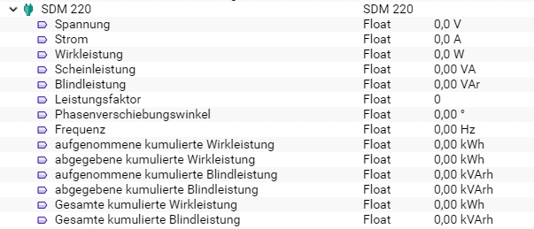

[](https://www.symcon.de/service/dokumentation/entwicklerbereich/sdk-tools/sdk-php/)
[](https://community.symcon.de/t/modul-alle-modbus-zaehler-von-b-g-e-tech/45290)
[](https://creativecommons.org/licenses/by-nc-sa/4.0/)  
[](https://www.symcon.de/service/dokumentation/installation/migrationen/v50-v51-q2-2019/)
[](https://github.com/Nall-chan/BGETech/actions) 
[](https://github.com/Nall-chan/BGETech/actions)  
[](#2-spenden)    


# SDM 220 <!-- omit in toc -->  

## Inhaltsverzeichnis <!-- omit in toc -->

- [1. Funktionsumfang](#1-funktionsumfang)
- [2. Voraussetzungen](#2-voraussetzungen)
- [3. Software-Installation](#3-software-installation)
- [4. Einrichten der Instanzen in IP-Symcon](#4-einrichten-der-instanzen-in-ip-symcon)
- [5. Statusvariablen und Profile](#5-statusvariablen-und-profile)
- [6. PHP-Befehlsreferenz](#6-php-befehlsreferenz)
- [7. Anhang](#7-anhang)
  - [1. Changelog](#1-changelog)
  - [2. Spenden](#2-spenden)
- [8. Lizenz](#8-lizenz)

## 1. Funktionsumfang

Ermöglicht die einfache Einbindung von Energie-Zählern des Typs SDM 220 der Firma B+G E-Tech. 
Zusätzlich können mehrere Zähler auf einem physikalischen RS485-Bus betrieben werden.  

## 2. Voraussetzungen

 - IPS 5.1 oder höher  
 - SDM 220 Zähler mit **ModBus-Interface**  
 - physikalisches RS485 Interface für die Zähler  

## 3. Software-Installation

 Dieses Modul ist Bestandteil der [B+G E-Tech Library](../README.md#3-software-installation).  

## 4. Einrichten der Instanzen in IP-Symcon

Das Modul ist im Dialog 'Instanz hinzufügen' unter dem Hersteller 'B+G E-Tech' zu finden.  
  

Es wird automatisch ein 'ModBus Gateway' als Splitter-Instanz, sowie ein 'Client Socket' als dessen I/O-Instanz erzeugt.  
In dem sich öffnenden Konfigurationsformular muss der Abfrage-Zyklus eingestellt werden.  
 Über den Button 'Gateway konfigurieren' wird das Konfigurationsformular des 'ModBus Gateway' geöffnet.  
    
Hier muss jetzt der Modus passend zur Hardwareanbindung (TCP /RTU) sowie die Geräte-ID des Zählers eingestellt und übernommen werden.  
Anschließend über den Button 'Schnittstelle konfigurieren' das Konfigurationsformular der I/O-Instanz öffnen.  
Je nach Hardwareanbindung müssen hier die RS485 Parameter oder die IP-Adresse des ModBus-Umsetzers eingetragen werden.  
Details hierzu sind dem Handbuch des Zählers (RS485) und dem eventuell verwendeten Umsetzer zu entnehmen.  

## 5. Statusvariablen und Profile

Folgende Statusvariablen werden automatisch angelegt.  

|                 Name                  |  Typ  |           Ident           |   Profil    |
| :-----------------------------------: | :---: | :-----------------------: | :---------: |
|               Spannung                | float |          Voltage          |  Volt.230   |
|                 Strom                 | float |          Current          |   Ampere    |
|             Wirkleistung              | float |        Activepower        | Watt.14490  |
|            Scheinleistung             | float |       Apparentpower       |     VA      |
|             Blindleistung             | float |       Reactivepower       |     VaR     |
|            Leistungsfaktor            | float |        Powerfactor        |             |
|       Phasenverschiebungswinkel       | float |        Phaseangle         | PhaseAngle  |
|               Frequenz                | float |         Frequency         |  Hertz.50   |
|    Gesamte kumulierte Wirkleistung    | float |     Totalactiveenergy     | Electricity |
|   Gesamte kumulierte Blindleistung    | float |    Totalreactiveenergy    |    kVArh    |
|  abgegebene kumulierte Wirkleistung   | float |     Totalexportenergy     | Electricity |
| aufgenommene kumulierte Wirkleistung  | float |     Totalimportenergy     | Electricity |
|  abgegebene kumulierte Blindleistung  | float | Totalexportreactiveenergy |    kVArh    |
| aufgenommene kumulierte Blindleistung | float | Totalimportreactiveenergy |    kVArh    |

Folgende Profile werden automatisch angelegt.  

|    Name     |  Typ  |
| :---------: | :---: |
| PhaseAngle  | float |
|     VA      | float |
|     VaR     | float |
| Intensity.F | float |
|    kVArh    | float |

Darstellung in der Console.  
 
## 6. PHP-Befehlsreferenz

```php
bool SDM220_RequestRead(int $InstanzID);
```
Ließt alle Werte vom Zähler.  
Bei Erfolg wird `true` und im Fehlerfall wird `false` zurückgegeben und eine Warnung erzeugt.  


## 7. Anhang

### 1. Changelog

[Changelog der Library](../README.md#2-changelog)

### 2. Spenden

Die Library ist für die nicht kommerzielle Nutzung kostenlos, Schenkungen als Unterstützung für den Autor werden hier akzeptiert:  

  PayPal:  
<a href="https://www.paypal.com/donate?hosted_button_id=G2SLW2MEMQZH2" target="_blank"></a>  

  Wunschliste:  
<a href="https://www.amazon.de/hz/wishlist/ls/YU4AI9AQT9F?ref_=wl_share" target="_blank"></a>  

## 8. Lizenz

  IPS-Modul:  
  [CC BY-NC-SA 4.0](https://creativecommons.org/licenses/by-nc-sa/4.0/)  
 
 
