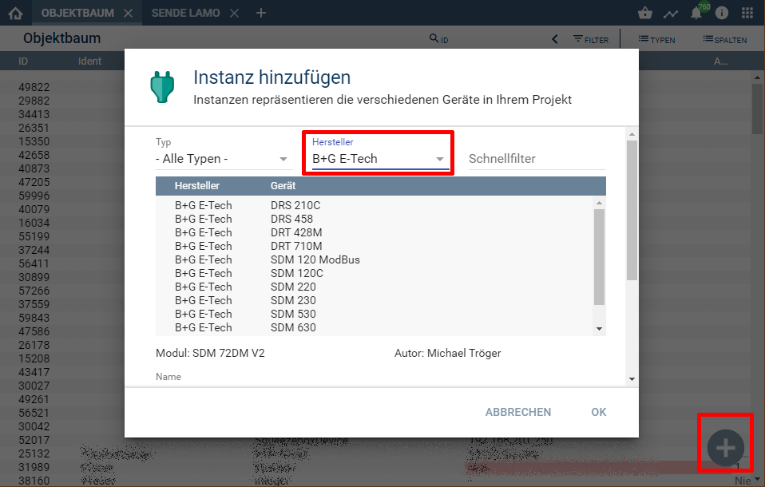

[](https://www.symcon.de/service/dokumentation/entwicklerbereich/sdk-tools/sdk-php/)
[]()
[](https://creativecommons.org/licenses/by-nc-sa/4.0/)  
[](https://www.symcon.de/forum/threads/30857-IP-Symcon-4-3-%28Stable%29-Changelog)

# SDM 630

## Dokumentation

**Inhaltsverzeichnis**

1. [Funktionsumfang](#1-funktionsumfang)  
2. [Voraussetzungen](#2-voraussetzungen)  
3. [Software-Installation](#3-software-installation) 
4. [Einrichten der Instanzen in IP-Symcon](#4-einrichten-der-instanzen-in-ip-symcon)
5. [Statusvariablen und Profile](#5-statusvariablen-und-profile)  
6. [PHP-Befehlsreferenz](#6-php-befehlsreferenz)   
7. [Anhang](#7-anhang)  
    1. [Changlog](#1-changlog)
    2. [Spenden](#2-spenden)
8. [Lizenz](#8-lizenz)

## 1. Funktionsumfang

Ermöglich die Einbindung von Energie-Zählern des Typs SDM 630 der Firma B+G E-Tech
ohne mehrere ModBus-Instanzen in IPS.  
Zusätzlich können mehrere Zähler auf einem physikalischen RS485-Bus
betrieben werden.  

## 2. Voraussetzungen

 - IPS 4.3 oder höher  
 - SDM 630 Zähler mit ModBus-Interface 
 - physikalisches RS485 Interface für die Zähler  

## 3. Software-Installation

Dieses Modul ist Bestandteil der IPSBGETEch-Library.

**IPS 4.3:**  
   Bei privater Nutzung: Über das 'Module-Control' in IPS folgende URL hinzufügen.  
    `git://github.com/Nall-chan/IPSBGETEch.git`  

   **Bei kommerzieller Nutzung (z.B. als Errichter oder Integrator) wenden Sie sich bitte an den Autor.**  

## 4. Einrichten der Instanzen in IP-Symcon

Das Modul ist im Dialog 'Instanz hinzufügen' unter dem Hersteller 'B+G E-Tech' zu finden.  
  

Es wird automatisch eine 'ModBus Gateway' als Splitter-Instanz, sowie ein 'Client Socket' als dessen I/O-Instanz erzeugt.  
Werden in dem sich öffnenden Konfigurationsformular muss der Abfrage-Zyklus eingestellt werden.  
Über den Button 'Gateway konfigurieren' oder das Zahnrad hinter der Übergeordneten Instanz wird das Konfigurationsformular des 'ModBus Gateway' geöffnet.  
Hier muss jetzt der Modus passend zur Hardwareanbindung (TCP /RTU) sowie die Geräte-ID des Zählers eingestellt und übernommen werden.  
Anschließend über den Button 'Schnittstelle konfigurieren' oder wieder über das Zahnrad hinter der Übergeordneten Instanz, das Konfigurationsformular der I/O-Instanz öffnen.  
Je nach Hardwareanbindung müssen hier die RS485 Parameter oder die IP-Adresse des ModBus-Umsetzers eingetragen werden.  
Details hierzu sind dem Handbuch des Zählers (RS485) und dem eventuell verwendeten Umsetzer zu entnehmen.  

## 5. Statusvariablen und Profile

Folgende Statusvariablen werden automatisch angelegt.  
 
| Name           | Typ   | Ident        | Profil          |
| :------------: | :---: | :----------: | :-------------: |
| Volt L1        | float | VoltL1       | ~Volt.230       |
| Volt L2        | float | VoltL2       | ~Volt.230       |
| Volt L3        | float | VoltL3       | ~Volt.230       |
| Ampere L1      | float | AmpereL1     | ~Ampere         |
| Ampere L2      | float | AmpereL2     | ~Ampere         |
| Ampere L3      | float | AmpereL3     | ~Ampere         |
| Frequenz       | float | Frequenz     | ~Hertz.50       |
| Watt L1        | float | WattL1       | ~Watt.14490     |
| Watt L2        | float | WattL2       | ~Watt.14490     |
| Watt L3        | float | WattL3       | ~Watt.14490     |
| VaR L1         | float | VArL1        | VaR             |
| VaR L2         | float | VArL2        | VaR             |
| VaR L3         | float | VArL3        | VaR             |
| VA L1          | float | VAL1         | VA              |
| VA L2          | float | VAL2         | VA              |
| VA L3          | float | VAL3         | VA              |
| Phase angle L1 | float | PhaseAngleL1 | PhaseAngle      | 
| Phase angle L2 | float | PhaseAngleL2 | PhaseAngle      | 
| Phase angle L3 | float | PhaseAngleL3 | PhaseAngle      | 
| Total L1 kWh   | float | TotalL1      | ~Electricity    | 
| Total L2 kWh   | float | TotalL1      | ~Electricity    | 
| Total L3 kWh   | float | TotalL1      | ~Electricity    | 

Folgende Profile werden automatisch angelegt.  

| Name       | Typ   |
| :--------: | :---: |
| PhaseAngle | float |
| VA         | float |
| VaR        | float |

## 6. PHP-Befehlsreferenz

```php
bool SDM630_RequestRead(int $InstanzID);
```
Ließt alle Werte vom Zähler.  
Bei Erfolg wird `true` und im Fehlerfall wird `false` zurückgegeben und eine Warnung erzeugt.  


## 7. Anhang

### 1. Changlog

Version 1.1:  
 - Profile ergänzt  
 - Doku ergänzt  

Version 1.0:  
 - Erstes offizielles Release  

### 2. Spenden  
  
  Die Library ist für die nicht kommzerielle Nutzung kostenlos, Schenkungen als Unterstützung für den Autor werden hier akzeptiert:  

<a href="https://www.paypal.com/cgi-bin/webscr?cmd=_s-xclick&hosted_button_id=G2SLW2MEMQZH2" target="_blank"></a>

## 8. Lizenz

  IPS-Modul:  
  [CC BY-NC-SA 4.0](https://creativecommons.org/licenses/by-nc-sa/4.0/)  
 
