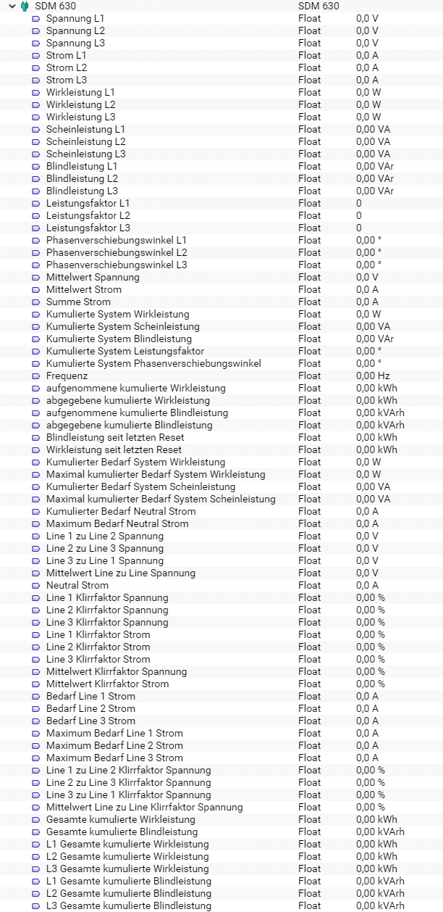

[](https://www.symcon.de/service/dokumentation/entwicklerbereich/sdk-tools/sdk-php/)
[]()
[](https://creativecommons.org/licenses/by-nc-sa/4.0/)  
[](https://www.symcon.de/forum/threads/30857-IP-Symcon-4-3-%28Stable%29-Changelog)

# SDM 630

## Dokumentation

**Inhaltsverzeichnis**

1. [Funktionsumfang](#1-funktionsumfang)  
2. [Voraussetzungen](#2-voraussetzungen)  
3. [Software-Installation](#3-software-installation) 
4. [Einrichten der Instanzen in IP-Symcon](#4-einrichten-der-instanzen-in-ip-symcon)
5. [Statusvariablen und Profile](#5-statusvariablen-und-profile)  
6. [PHP-Befehlsreferenz](#6-php-befehlsreferenz)   
7. [Anhang](#7-anhang)  
    1. [Changlog](#1-changlog)
    2. [Spenden](#2-spenden)
8. [Lizenz](#8-lizenz)

## 1. Funktionsumfang

Ermöglich die einfache Einbindung von Energie-Zählern des Typs SDM 630 der Firma B+G E-Tech.  
Zusätzlich können mehrere Zähler auf einem physikalischen RS485-Bus betrieben werden.  

## 2. Voraussetzungen

 - IPS 4.3 oder höher  
 - SDM 630 Zähler mit 'ModBus-Interface 
 - physikalisches RS485 Interface für die Zähler  

## 3. Software-Installation

Dieses Modul ist Bestandteil der IPSBGETEch-Library.

**IPS 4.3:**  
   Bei privater Nutzung: Über das 'Module-Control' in IPS folgende URL hinzufügen.  
    `git://github.com/Nall-chan/IPSBGETEch.git`  

   **Bei kommerzieller Nutzung (z.B. als Errichter oder Integrator) wenden Sie sich bitte an den Autor.**  

## 4. Einrichten der Instanzen in IP-Symcon

Das Modul ist im Dialog 'Instanz hinzufügen' unter dem Hersteller 'B+G E-Tech' zu finden.  
  

Es wird automatisch eine 'ModBus Gateway' als Splitter-Instanz, sowie ein 'Client Socket' als dessen I/O-Instanz erzeugt.  
Werden in dem sich öffnenden Konfigurationsformular muss der Abfrage-Zyklus eingestellt werden.  
Über den Button 'Gateway konfigurieren' oder das Zahnrad hinter der Übergeordneten Instanz wird das Konfigurationsformular des 'ModBus Gateway' geöffnet.  
Hier muss jetzt der Modus passend zur Hardwareanbindung (TCP /RTU) sowie die Geräte-ID des Zählers eingestellt und übernommen werden.  
Anschließend über den Button 'Schnittstelle konfigurieren' oder wieder über das Zahnrad hinter der Übergeordneten Instanz, das Konfigurationsformular der I/O-Instanz öffnen.  
Je nach Hardwareanbindung müssen hier die RS485 Parameter oder die IP-Adresse des ModBus-Umsetzers eingetragen werden.  
Details hierzu sind dem Handbuch des Zählers (RS485) und dem eventuell verwendeten Umsetzer zu entnehmen.  

## 5. Statusvariablen und Profile

Folgende Statusvariablen werden automatisch angelegt.  

| Name                                              | Typ   | Ident                                      | Profil       |
| :-----------------------------------------------: | :---: | :----------------------------------------: | :----------: |
| Spannung L1                                       | float | Voltage L1                                 | Volt.230     |
| Spannung L2                                       | float | Voltage L2                                 | Volt.230     |
| Spannung L3                                       | float | Voltage L3                                 | Volt.230     |
| Strom L1                                          | float | Current L1                                 | Ampere       |
| Strom L2                                          | float | Current L2                                 | Ampere       |
| Strom L3                                          | float | Current L3                                 | Ampere       |
| Wirkleistung L1                                   | float | Active power L1                            | Watt.14490   |
| Wirkleistung L2                                   | float | Active power L2                            | Watt.14490   |
| Wirkleistung L3                                   | float | Active power L3                            | Watt.14490   |
| Scheinleistung L1                                 | float | Apparent power L1                          | VA           |
| Scheinleistung L2                                 | float | Apparent power L2                          | VA           |
| Scheinleistung L3                                 | float | Apparent power L3                          | VA           |
| Blindleistung L1                                  | float | Reactive power L1                          | VaR          |
| Blindleistung L2                                  | float | Reactive power L2                          | VaR          |
| Blindleistung L3                                  | float | Reactive power L3                          | VaR          |
| Leistungsfaktor L1                                | float | Power factor L1                            |              |
| Leistungsfaktor L2                                | float | Power factor L2                            |              |
| Leistungsfaktor L3                                | float | Power factor L3                            |              |
| Phasenverschiebungswinkel L1                      | float | Phase angle L1                             | PhaseAngle   |
| Phasenverschiebungswinkel L2                      | float | Phase angle L2                             | PhaseAngle   |
| Phasenverschiebungswinkel L3                      | float | Phase angle L3                             | PhaseAngle   |
| Mittelwert Spannung                               | float | Average line to neutral voltage            | Volt.230     |
| Mittelwert Strom                                  | float | Average line current                       | Ampere       |
| Summe Strom                                       | float | Sum of line currents                       | Ampere       |
| Kumulierte System Wirkleistung                    | float | Total system power                         | Watt.14490   |
| Kumulierte System Scheinleistung                  | float | Total system apparent power                | VA           |
| Kumulierte System Blindleistung                   | float | Total system reactive power                | VaR          |
| Kumulierte System Leistungsfaktor                 | float | Total system power factor                  |              |
| Kumulierte System Phasenverschiebungswinkel       | float | Total system phase angle                   | PhaseAngle   |
| Frequenz                                          | float | Frequency                                  | Hertz.50     |
| Kumulierter Bedarf System Wirkleistung            | float | Total system power demand                  | Watt.14490   |
| Maximal kumulierter Bedarf System Wirkleistung    | float | Maximum total system power demand          | Watt.14490   |
| Kumulierter Bedarf System Scheinleistung          | float | Total system apparent power demand         | VA           |
| Maximal kumulierter Bedarf System Scheinleistung  | float | Maximum total system apparent power demand | VA           |
| Kumulierter Bedarf Neutral Strom                  | float | Total neutral current demand               | Ampere       |
| Maximum Bedarf Neutral Strom                      | float | Maximum neutral current demand             | Ampere       |
| Line 1 zu Line 2 Spannung                         | float | Line 1 to Line 2 voltage                   | Volt.230     |
| Line 2 zu Line 3 Spannung                         | float | Line 2 to Line 3 voltage                   | Volt.230     |
| Line 3 zu Line 1 Spannung                         | float | Line 3 to Line 1 voltage                   | Volt.230     |
| Mittelwert Line zu Line Spannung                  | float | Average line to line voltage               | Volt.230     |
| Neutral Strom                                     | float | Neutral current                            | Ampere       |
| Line 1 Klirrfaktor Spannung                       | float | Line 1 voltage THD                         | Intensity.F  |
| Line 2 Klirrfaktor Spannung                       | float | Line 2 voltage THD                         | Intensity.F  |
| Line 3 Klirrfaktor Spannung                       | float | Line 3 voltage THD                         | Intensity.F  |
| Line 1 Klirrfaktor Strom                          | float | Line 1 Current THD                         | Intensity.F  |
| Line 2 Klirrfaktor Strom                          | float | Line 2 Current THD                         | Intensity.F  |
| Line 3 Klirrfaktor Strom                          | float | Line 3 Current THD                         | Intensity.F  |
| Mittelwert Klirrfaktor Spannung                   | float | Average line to neutral voltage THD        | Intensity.F  |
| Mittelwert Klirrfaktor Strom                      | float | Average line current THD                   | Intensity.F  |
| Kumulierte System Leistungsfaktor                 | float | Total system power factor                  | PhaseAngle   |
| Bedarf Line 1 Strom                               | float | Line 1 current demand                      | Ampere       |
| Bedarf Line 2 Strom                               | float | Line 2 current demand                      | Ampere       |
| Bedarf Line 3 Strom                               | float | Line 3 current demand                      | Ampere       |
| Maximum Bedarf Line 1 Strom                       | float | Maximum line 1 current demand              | Ampere       |
| Maximum Bedarf Line 2 Strom                       | float | Maximum line 2 current demand              | Ampere       |
| Maximum Bedarf Line 3 Strom                       | float | Maximum line 3 current demand              | Ampere       |
| Line 1 zu Line 2 Klirrfaktor Spannung             | float | Line 1 to line 2 voltage THD               | Intensity.F  |
| Line 2 zu Line 3 Klirrfaktor Spannung             | float | Line 2 to line 3 voltage THD               | Intensity.F  |
| Line 3 zu Line 1 Klirrfaktor Spannung             | float | Line 3 to line 1 voltage THD               | Intensity.F  |
| Mittelwert Line zu Line Klirrfaktor Spannung      | float | Average line to line voltage THD           | Intensity.F  |
| Gesamte kumulierte Wirkleistung                   | float | Total active energy                        | Electricity  |
| Gesamte kumulierte Blindleistung                  | float | Total reactive energy                      | kVArh        |
| L1 Gesamte kumulierte Wirkleistung                | float | L1 total active energy                     | Electricity  |
| L2 Gesamte kumulierte Wirkleistung                | float | L2 total active energy                     | Electricity  |
| L3 Gesamte kumulierte Wirkleistung                | float | L3 total active energy                     | Electricity  |
| L1 Gesamte kumulierte Blindleistung               | float | L1 total reactive energy                   | kVArh        |
| L2 Gesamte kumulierte Blindleistung               | float | L2 total reactive energy                   | kVArh        |
| L3 Gesamte kumulierte Blindleistung               | float | L3 total reactive energy                   | kVArh        |

Folgende Profile werden automatisch angelegt.  

| Name        | Typ   |
| :---------: | :---: |
| PhaseAngle  | float |
| VA          | float |
| VaR         | float |
| Intensity.F | float |
| kVArh       | float |

Darstellung in der Console.  
 

## 6. PHP-Befehlsreferenz

```php
bool SDM630_RequestRead(int $InstanzID);
```
Ließt alle Werte vom Zähler.  
Bei Erfolg wird `true` und im Fehlerfall wird `false` zurückgegeben und eine Warnung erzeugt.  


## 7. Anhang

### 1. Changlog

Version 2.0:  
 - DRS 458 ergänzt  
 - SDM 72D ergänzt  
 - SDM 120C ergänzt  
 - SDM 220 ergänzt  
 - SDM 230 ergänzt  
 - SDM 630 fehlende Werte ergänzt und kleiner Bugfixes  

Version 1.1:  
 - Profile ergänzt  
 - Doku ergänzt  

Version 1.0:  
 - Erstes offizielles Release  

### 2. Spenden  
  
  Die Library ist für die nicht kommzerielle Nutzung kostenlos, Schenkungen als Unterstützung für den Autor werden hier akzeptiert:  

<a href="https://www.paypal.com/cgi-bin/webscr?cmd=_s-xclick&hosted_button_id=G2SLW2MEMQZH2" target="_blank"></a>

## 8. Lizenz

  IPS-Modul:  
  [CC BY-NC-SA 4.0](https://creativecommons.org/licenses/by-nc-sa/4.0/)  
 
