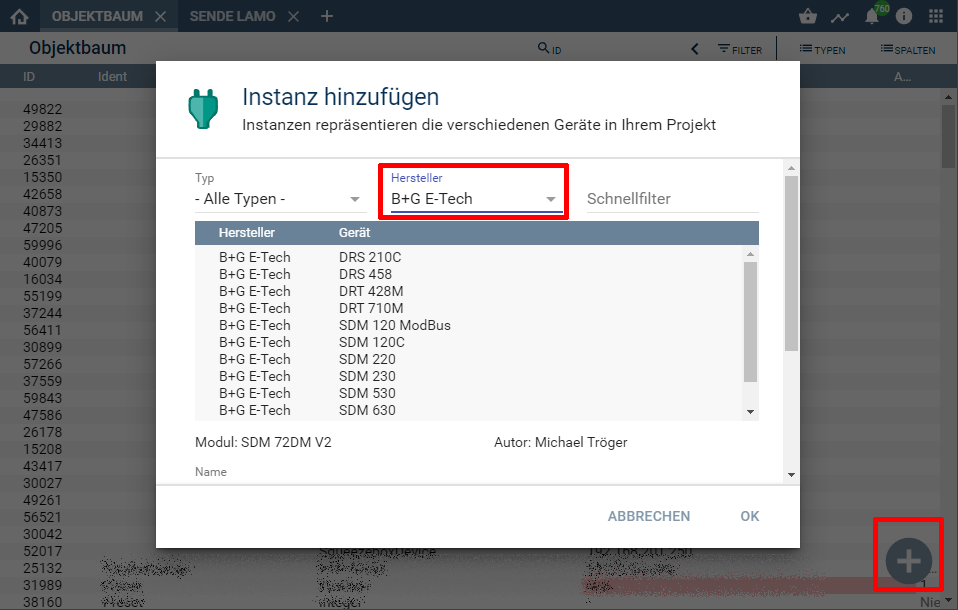

[](https://www.symcon.de/service/dokumentation/entwicklerbereich/sdk-tools/sdk-php/)
[](https://community.symcon.de/t/modul-alle-modbus-zaehler-von-b-g-e-tech/45290)
  
[](https://creativecommons.org/licenses/by-nc-sa/4.0/)
[](https://github.com/Nall-chan/BGETech/actions) 
[](https://github.com/Nall-chan/BGETech/actions)  
[](#2-spenden)
[](#2-spenden)  

# SDM 72DM-V2 <!-- omit in toc -->  

## Inhaltsverzeichnis <!-- omit in toc -->

- [1. Funktionsumfang](#1-funktionsumfang)
- [2. Voraussetzungen](#2-voraussetzungen)
- [3. Software-Installation](#3-software-installation)
- [4. Einrichten der Instanzen in IP-Symcon](#4-einrichten-der-instanzen-in-ip-symcon)
- [5. Statusvariablen und Profile](#5-statusvariablen-und-profile)
- [6. PHP-Befehlsreferenz](#6-php-befehlsreferenz)
- [7. Anhang](#7-anhang)
  - [1. Changelog](#1-changelog)
  - [2. Spenden](#2-spenden)
- [8. Lizenz](#8-lizenz)

## 1. Funktionsumfang

Ermöglicht die einfache Einbindung von Energie-Zählern des Typs SDM 72DM-V2 der Firma B+G E-Tech. 
Zusätzlich können mehrere Zähler auf einem physikalischen RS485-Bus betrieben werden.  

## 2. Voraussetzungen

 - IPS 5.1 oder höher  
 - SDM 72DM-V2 Zähler mit **ModBus-Interface**  
 - physikalisches RS485 Interface für die Zähler  

## 3. Software-Installation

 Dieses Modul ist Bestandteil der [B+G E-Tech Library](../README.md#3-software-installation).  

## 4. Einrichten der Instanzen in IP-Symcon

Das Modul ist im Dialog 'Instanz hinzufügen' unter dem Hersteller 'B+G E-Tech' zu finden.  
  

Es wird automatisch ein 'ModBus Gateway' als Splitter-Instanz, sowie ein 'Client Socket' als dessen I/O-Instanz erzeugt.  
In dem sich öffnenden Konfigurationsformular muss der Abfrage-Zyklus eingestellt werden.  
 Über den Button 'Gateway konfigurieren' wird das Konfigurationsformular des 'ModBus Gateway' geöffnet.  
    
Hier muss jetzt der Modus passend zur Hardwareanbindung (TCP /RTU) sowie die Geräte-ID des Zählers eingestellt und übernommen werden.  
Anschließend über den Button 'Schnittstelle konfigurieren' das Konfigurationsformular der I/O-Instanz öffnen.  
Je nach Hardwareanbindung müssen hier die RS485 Parameter oder die IP-Adresse des ModBus-Umsetzers eingetragen werden.  
Details hierzu sind dem Handbuch des Zählers (RS485) und dem eventuell verwendeten Umsetzer zu entnehmen.  

## 5. Statusvariablen und Profile

Folgende Statusvariablen werden automatisch angelegt.  

|                        Name                         |  Typ  |            Ident            |   Profil    |
| :-------------------------------------------------: | :---: | :-------------------------: | :---------: |
|                     Spannung L1                     | float |          VoltageL1          |  Volt.230   |
|                     Spannung L2                     | float |          VoltageL2          |  Volt.230   |
|                     Spannung L3                     | float |          VoltageL3          |  Volt.230   |
|                      Strom L1                       | float |          CurrentL1          |   Ampere    |
|                      Strom L2                       | float |          CurrentL2          |   Ampere    |
|                      Strom L3                       | float |          CurrentL3          |   Ampere    |
|                   Wirkleistung L1                   | float |        ActivepowerL1        | Watt.14490  |
|                   Wirkleistung L2                   | float |        ActivepowerL2        | Watt.14490  |
|                   Wirkleistung L3                   | float |        ActivepowerL3        | Watt.14490  |
|                  Scheinleistung L1                  | float |       ApparentpowerL1       |     VA      |
|                  Scheinleistung L2                  | float |       ApparentpowerL2       |     VA      |
|                  Scheinleistung L3                  | float |       ApparentpowerL3       |     VA      |
|                  Blindleistung L1                   | float |       ReactivepowerL1       |     VaR     |
|                  Blindleistung L2                   | float |       ReactivepowerL2       |     VaR     |
|                  Blindleistung L3                   | float |       ReactivepowerL3       |     VaR     |
|                 Leistungsfaktor L1                  | float |        PowerfactorL1        |             |
|                 Leistungsfaktor L2                  | float |        PowerfactorL2        |             |
|                 Leistungsfaktor L3                  | float |        PowerfactorL3        |             |
|                 Mittelwert Spannung                 | float | Averagelinetoneutralvoltage |  Volt.230   |
|                  Mittelwert Strom                   | float |     Averagelinecurrent      |   Ampere    |
|                     Summe Strom                     | float |      Sumoflinecurrents      |   Ampere    |
|           Kumulierte System Wirkleistung            | float |      Totalsystempower       | Watt.14490  |
|          Kumulierte System Scheinleistung           | float |  Totalsystemapparentpower   |     VA      |
|           Kumulierte System Blindleistung           | float |  Totalsystemreactivepower   |     VaR     |
|          Kumulierte System Leistungsfaktor          | float |   Totalsystempowerfactor    |             |
|                      Frequenz                       | float |          Frequency          |  Hertz.50   |
|        aufgenommene kumulierte Wirkleistung         | float |      Totalimportenergy      | Electricity |
|         abgegebene kumulierte Wirkleistung          | float |      Totalexportenergy      | Electricity |
|                  L1 zu L2 Spannung                  | float |     Line1toLine2voltage     |  Volt.230   |
|                  L2 zu L3 Spannung                  | float |     Line2toLine3voltage     |  Volt.230   |
|                  L3 zu L1 Spannung                  | float |     Line3toLine1voltage     |  Volt.230   |
|             Mittelwert L zu L Spannung              | float |  Averagelinetolinevoltage   |  Volt.230   |
|                    Neutral Strom                    | float |       Neutralcurrent        |   Ampere    |
|           Gesamte kumulierte Wirkleistung           | float |      Totalactiveenergy      | Electricity |
|          Gesamte kumulierte Blindleistung           | float |     Totalreactiveenergy     |    kVArh    |
|   Gesamte kumulierte Wirkleistung (rückstellbar)    | float |    Resettabletotalenergy    | Electricity |
| aufgenommene kumulierte Wirkleistung (rückstellbar) | float |   Resettableimportenergy    | Electricity |
|  abgegebene kumulierte Wirkleistung (rückstellbar)  | float |   Resettableexportenergy    | Electricity |
|                 Netto-Wirkleistung                  | float |      Nettoactiveenergy      | Electricity |
|              aufgenommene Wirkleistung              | float |         Importpower         | Watt.14490  |
|               abgegebene Wirkleistung               | float |         Exportpower         | Watt.14490  |


Folgende Profile werden automatisch angelegt.  

|    Name     |  Typ  |
| :---------: | :---: |
| PhaseAngle  | float |
|     VA      | float |
|     VaR     | float |
| Intensity.F | float |
|    kVArh    | float |

Darstellung in der Console.  
 

## 6. PHP-Befehlsreferenz

```php
bool SDM72DMV2_RequestRead(int $InstanzID);
```
Ließt alle Werte vom Zähler.  
Bei Erfolg wird `true` und im Fehlerfall wird `false` zurückgegeben und eine Warnung erzeugt.  


## 7. Anhang

### 1. Changelog

[Changelog der Library](../README.md#2-changelog)

### 2. Spenden

Die Library ist für die nicht kommerzielle Nutzung kostenlos, Schenkungen als Unterstützung für den Autor werden hier akzeptiert:  

<a href="https://www.paypal.com/donate?hosted_button_id=G2SLW2MEMQZH2" target="_blank"></a>

[](https://www.amazon.de/hz/wishlist/ls/YU4AI9AQT9F?ref_=wl_share)  

## 8. Lizenz

  IPS-Modul:  
  [CC BY-NC-SA 4.0](https://creativecommons.org/licenses/by-nc-sa/4.0/)  
 
 