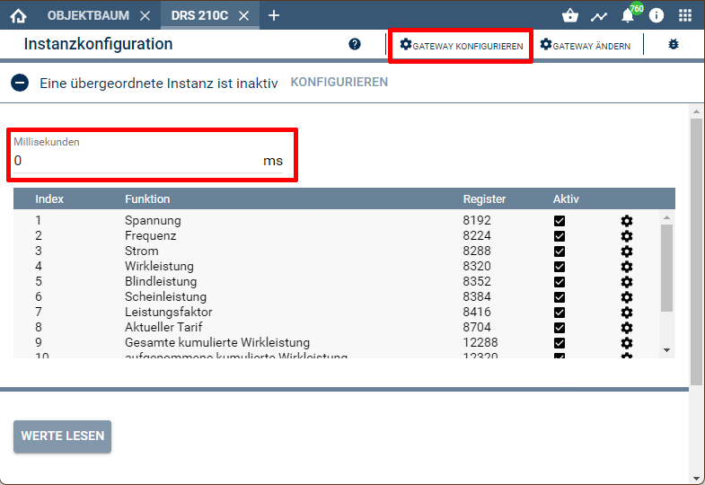
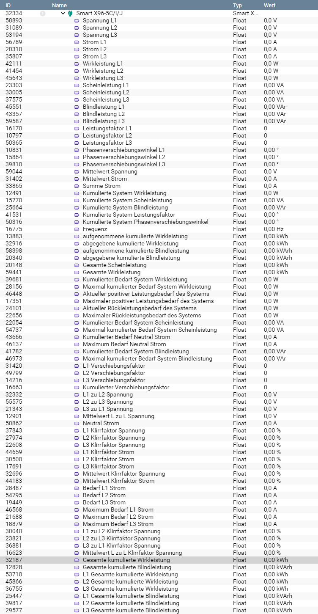

[](https://www.symcon.de/service/dokumentation/entwicklerbereich/sdk-tools/sdk-php/)
[](https://community.symcon.de/t/modul-alle-modbus-zaehler-von-b-g-e-tech/45290)
[](https://creativecommons.org/licenses/by-nc-sa/4.0/)  
[](https://www.symcon.de/service/dokumentation/installation/migrationen/v50-v51-q2-2019/)
[](https://github.com/Nall-chan/BGETech/actions) 
[](https://github.com/Nall-chan/BGETech/actions)  
[](#2-spenden)    


# Smart X96-5C/I/J <!-- omit in toc -->  

## Inhaltsverzeichnis <!-- omit in toc -->

- [1. Funktionsumfang](#1-funktionsumfang)
- [2. Voraussetzungen](#2-voraussetzungen)
- [3. Software-Installation](#3-software-installation)
- [4. Einrichten der Instanzen in IP-Symcon](#4-einrichten-der-instanzen-in-ip-symcon)
- [5. Statusvariablen und Profile](#5-statusvariablen-und-profile)
- [6. PHP-Befehlsreferenz](#6-php-befehlsreferenz)
- [7. Anhang](#7-anhang)
  - [1. Changelog](#1-changelog)
  - [2. Spenden](#2-spenden)
- [8. Lizenz](#8-lizenz)

## 1. Funktionsumfang

Ermöglicht die einfache Einbindung von Energie-Zählern des Typs SDM 630 der Firma B+G E-Tech.  
Zusätzlich können mehrere Zähler auf einem physikalischen RS485-Bus betrieben werden.  

## 2. Voraussetzungen

 - IPS 5.1 oder höher  
 - Smart X96-5C/I/J Zähler mit **ModBus-Interface**  
 - physikalisches RS485 Interface für die Zähler  

## 3. Software-Installation

 Dieses Modul ist Bestandteil der [B+G E-Tech Library](../README.md#3-software-installation).  

## 4. Einrichten der Instanzen in IP-Symcon

Das Modul ist im Dialog 'Instanz hinzufügen' unter dem Hersteller 'B+G E-Tech' zu finden.  
  

Es wird automatisch ein 'ModBus Gateway' als Splitter-Instanz, sowie ein 'Client Socket' als dessen I/O-Instanz erzeugt.  
In dem sich öffnenden Konfigurationsformular muss der Abfrage-Zyklus eingestellt werden.  
 Über den Button 'Gateway konfigurieren' wird das Konfigurationsformular des 'ModBus Gateway' geöffnet.  
    
Hier muss jetzt der Modus passend zur Hardwareanbindung (TCP /RTU) sowie die Geräte-ID des Zählers eingestellt und übernommen werden.  
Anschließend über den Button 'Schnittstelle konfigurieren' das Konfigurationsformular der I/O-Instanz öffnen.  
Je nach Hardwareanbindung müssen hier die RS485 Parameter oder die IP-Adresse des ModBus-Umsetzers eingetragen werden.  
Details hierzu sind dem Handbuch des Zählers (RS485) und dem eventuell verwendeten Umsetzer zu entnehmen.  

## 5. Statusvariablen und Profile

Folgende Statusvariablen werden automatisch angelegt.  

|                       Name                       |  Typ  |                 Ident                 |   Profil    |
| :----------------------------------------------: | :---: | :-----------------------------------: | :---------: |
|                   Spannung L1                    | float |               VoltageL1               |  Volt.230   |
|                   Spannung L2                    | float |               VoltageL2               |  Volt.230   |
|                   Spannung L3                    | float |               VoltageL3               |  Volt.230   |
|                     Strom L1                     | float |               CurrentL1               |   Ampere    |
|                     Strom L2                     | float |               CurrentL2               |   Ampere    |
|                     Strom L3                     | float |               CurrentL3               |   Ampere    |
|                 Wirkleistung L1                  | float |             ActivepowerL1             | Watt.14490  |
|                 Wirkleistung L2                  | float |             ActivepowerL2             | Watt.14490  |
|                 Wirkleistung L3                  | float |             ActivepowerL3             | Watt.14490  |
|                Scheinleistung L1                 | float |            ApparentpowerL1            |     VA      |
|                Scheinleistung L2                 | float |            ApparentpowerL2            |     VA      |
|                Scheinleistung L3                 | float |            ApparentpowerL3            |     VA      |
|                 Blindleistung L1                 | float |            ReactivepowerL1            |     VaR     |
|                 Blindleistung L2                 | float |            ReactivepowerL2            |     VaR     |
|                 Blindleistung L3                 | float |            ReactivepowerL3            |     VaR     |
|                Leistungsfaktor L1                | float |             PowerfactorL1             |             |
|                Leistungsfaktor L2                | float |             PowerfactorL2             |             |
|                Leistungsfaktor L3                | float |             PowerfactorL3             |             |
|           Phasenverschiebungswinkel L1           | float |             PhaseangleL1              | PhaseAngle  |
|           Phasenverschiebungswinkel L2           | float |             PhaseangleL2              | PhaseAngle  |
|           Phasenverschiebungswinkel L3           | float |             PhaseangleL3              | PhaseAngle  |
|               Mittelwert Spannung                | float |      Averagelinetoneutralvoltage      |  Volt.230   |
|                 Mittelwert Strom                 | float |          Averagelinecurrent           |   Ampere    |
|                   Summe Strom                    | float |           Sumoflinecurrents           |   Ampere    |
|          Kumulierte System Wirkleistung          | float |           Totalsystempower            | Watt.14490  |
|         Kumulierte System Scheinleistung         | float |       Totalsystemapparentpower        |     VA      |
|         Kumulierte System Blindleistung          | float |       Totalsystemreactivepower        |     VaR     |
|        Kumulierte System Leistungsfaktor         | float |        Totalsystempowerfactor         |             |
|   Kumulierte System Phasenverschiebungswinkel    | float |         Totalsystemphaseangle         | PhaseAngle  |
|                     Frequenz                     | float |               Frequency               |  Hertz.50   |
|      Kumulierter Bedarf System Wirkleistung      | float |        Totalsystempowerdemand         | Watt.14490  |
|  Maximal kumulierter Bedarf System Wirkleistung  | float |     Maximumtotalsystempowerdemand     | Watt.14490  |
| Aktueller positiver Leistungsbedarf des Systems  | float |   Currentsystempositivepowerdemand    | Watt.14490  |
| Maximaler positiver Leistungsbedarf des Systems  | float |   Maximumsystempositivepowerdemand    | Watt.14490  |
|    Aktueller Rückleistungsbedarf des Systems     | float |    Currentsystemreversepowerdemand    | Watt.14490  |
|    Maximaler Rückleistungsbedarf des Systems     | float |    Maximumsystemreversepowerdemand    | Watt.14490  |
|     Kumulierter Bedarf System Scheinleistung     | float |    Totalsystemapparentpowerdemand     |     VA      |
| Maximal kumulierter Bedarf System Scheinleistung | float | Maximumtotalsystemapparentpowerdemand |     VA      |
|         Kumulierter Bedarf Neutral Strom         | float |       Totalneutralcurrentdemand       |   Ampere    |
|           Maximum Bedarf Neutral Strom           | float |      Maximumneutralcurrentdemand      |   Ampere    |
|     Kumulierter Bedarf System Blindleistung      | float |    Totalsystemreactivepowerdemand     |     VaR     |
| Maximal kumulierter Bedarf System Blindleistung  | float | Maximumtotalsystemreactivepowerdemand |     VaR     |
|              L1 Verschiebungsfaktor              | float |     Phase1displacementpowerfactor     |             |
|              L2 Verschiebungsfaktor              | float |     Phase2displacementpowerfactor     |             |
|              L3 Verschiebungsfaktor              | float |     Phase3displacementpowerfactor     |             |
|         Kumulierter Verschiebungsfaktor          | float |     Totaldisplacementpowerfactor      |             |
|                L1 zu L2 Spannung                 | float |          Line1toLine2voltage          |  Volt.230   |
|                L2 zu L3 Spannung                 | float |          Line2toLine3voltage          |  Volt.230   |
|                L3 zu L1 Spannung                 | float |          Line3toLine1voltage          |  Volt.230   |
|            Mittelwert L zu L Spannung            | float |       Averagelinetolinevoltage        |  Volt.230   |
|                  Neutral Strom                   | float |            Neutralcurrent             |   Ampere    |
|             L1 Klirrfaktor Spannung              | float |            Line1voltageTHD            | Intensity.F |
|             L2 Klirrfaktor Spannung              | float |            Line2voltageTHD            | Intensity.F |
|             L3 Klirrfaktor Spannung              | float |            Line3voltageTHD            | Intensity.F |
|               L1 Klirrfaktor Strom               | float |            Line1CurrentTHD            | Intensity.F |
|               L2 Klirrfaktor Strom               | float |            Line2CurrentTHD            | Intensity.F |
|               L3 Klirrfaktor Strom               | float |            Line3CurrentTHD            | Intensity.F |
|         Mittelwert Klirrfaktor Spannung          | float |    AveragelinetoneutralvoltageTHD     | Intensity.F |
|           Mittelwert Klirrfaktor Strom           | float |         AveragelinecurrentTHD         | Intensity.F |
|        Kumulierte System Leistungsfaktor         | float |        Totalsystempowerfactor         | PhaseAngle  |
|                 Bedarf L1 Strom                  | float |          Line1currentdemand           |   Ampere    |
|                 Bedarf L2 Strom                  | float |          Line2currentdemand           |   Ampere    |
|                 Bedarf L3 Strom                  | float |          Line3currentdemand           |   Ampere    |
|             Maximum Bedarf L1 Strom              | float |       Maximumline1currentdemand       |   Ampere    |
|             Maximum Bedarf L2 Strom              | float |       Maximumline2currentdemand       |   Ampere    |
|             Maximum Bedarf L3 Strom              | float |       Maximumline3currentdemand       |   Ampere    |
|          L1 zu L2 Klirrfaktor Spannung           | float |        Line1toline2voltageTHD         | Intensity.F |
|          L2 zu L3 Klirrfaktor Spannung           | float |        Line2toline3voltageTHD         | Intensity.F |
|          L3 zu L1 Klirrfaktor Spannung           | float |        Line3toline1voltageTHD         | Intensity.F |
|      Mittelwert L zu L Klirrfaktor Spannung      | float |      AveragelinetolinevoltageTHD      | Intensity.F |
|         Gesamte kumulierte Wirkleistung          | float |           Totalactiveenergy           | Electricity |
|         Gesamte kumulierte Blindleistung         | float |          Totalreactiveenergy          |    kVArh    |
|        L1 Gesamte kumulierte Wirkleistung        | float |          L1totalactiveenergy          | Electricity |
|        L2 Gesamte kumulierte Wirkleistung        | float |          L2totalactiveenergy          | Electricity |
|        L3 Gesamte kumulierte Wirkleistung        | float |          L3totalactiveenergy          | Electricity |
|       L1 Gesamte kumulierte Blindleistung        | float |         L1totalreactiveenergy         |    kVArh    |
|       L2 Gesamte kumulierte Blindleistung        | float |         L2totalreactiveenergy         |    kVArh    |
|       L3 Gesamte kumulierte Blindleistung        | float |         L3totalreactiveenergy         |    kVArh    |
|        abgegebene kumulierte Wirkleistung        | float |           Totalexportenergy           | Electricity |
|       aufgenommene kumulierte Wirkleistung       | float |           Totalimportenergy           | Electricity |
|       abgegebene kumulierte Blindleistung        | float |       Totalexportreactiveenergy       |    kVArh    |
|      aufgenommene kumulierte Blindleistung       | float |       Totalimportreactiveenergy       |    kVArh    |
|         Blindleistung seit letzten Reset         | float |     Reactiveenergysincelastreset      | Electricity |
|         Wirkleistung seit letzten Reset          | float |         Energysincelastreset          |    kVArh    |

Folgende Profile werden automatisch angelegt.  

|    Name     |  Typ  |
| :---------: | :---: |
| PhaseAngle  | float |
|     VA      | float |
|     VaR     | float |
| Intensity.F | float |
|    kVArh    | float |

Darstellung in der Console.  
 

## 6. PHP-Befehlsreferenz

```php
bool X965C_RequestRead(int $InstanzID);
```
Ließt alle Werte vom Zähler.  
Bei Erfolg wird `true` und im Fehlerfall wird `false` zurückgegeben und eine Warnung erzeugt.  


## 7. Anhang

### 1. Changelog

[Changelog der Library](../README.md#2-changelog)

### 2. Spenden

Die Library ist für die nicht kommerzielle Nutzung kostenlos, Schenkungen als Unterstützung für den Autor werden hier akzeptiert:  

  PayPal:  
<a href="https://www.paypal.com/donate?hosted_button_id=G2SLW2MEMQZH2" target="_blank"></a>  

  Wunschliste:  
<a href="https://www.amazon.de/hz/wishlist/ls/YU4AI9AQT9F?ref_=wl_share" target="_blank"></a>  

## 8. Lizenz

  IPS-Modul:  
  [CC BY-NC-SA 4.0](https://creativecommons.org/licenses/by-nc-sa/4.0/)  
 
